# 履歷表CV

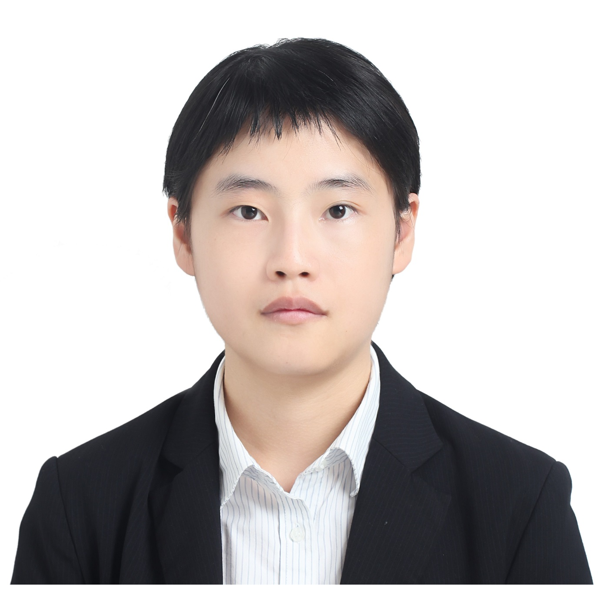

## 江欣蒨 (Raven)

從事APP開發相關工作已經四年，從視障者輔具、終端應用軟體、網頁轉換成跨平台APP到目前的物流相關可攜式裝置應用軟體設計等專案開發，對於軟體應用開發有高度興趣。目前嫻熟使用 Flutter、Kotlin、Android Java，並持續學習軟體設計各方面開發及運用能力，力求有效解決不同層面的問題。

📧 hcchiang92@gmail.com

🌐 [https://github.com/ChivialK/MyHomePage](https://github.com/ChivialK/MyHomePage)

📱+886 970322881

📍Taichung, Taiwan

🔗 Quick Link: | [工作經歷]() | [專案介紹]() | [中英文自傳]() | [作品連結]()

> App Software Developer | 4~5 Years Android App Projects | 1~2 Year Flutter Cross-Platform App Projects | A Sports Lover

---

# 學歷

- 中山醫學大學 —— 醫學資訊系
(Sep 2014 - July 2017)
- 銘傳大學 —— 資訊管理系
(Sep 2010 - June 2014)

---

# 主要技能

[Skill Table](https://www.notion.so/ec3cae88835b45e7818acc40e0d9677b)

---

# 工作經歷

- 睿隆科技有限公司 ****| APP軟體開發工程師

    July. 2019 - Feb. 2021

    - 公司展示用網頁轉為原生 Android APP 開發和上架，以及將舊版網站打包成APP後的更新與發佈工作。
    - 公司承包網頁轉為跨平台 Flutter APP 開發、上架及更新維護工作
    - 協助前端網站測試及後端API資料來回測試
    - 協助公司商務對客戶提出之APP功能需求的開發問題技術層面討論
- 愛唱久久音樂科技有限公司 ****| 終端軟體開發小組組長

    Nov. 2017 - June. 2019

    - 帶領小組成員負責機上盒所需應用軟體的開發工作
    - 協助視覺設計師 UI & UX 開發及畫面設計
    - 協助系統工程師做Android客製化系統的軟硬體整合及測試工作
    - 負責與後端工程師協商開發所需功能API
    - 團隊成員管理，定期主持開發小組會議

---

## 睿隆科技專案項目

公司承包網頁轉為跨平台 Flutter APP 開發、上架並提供更新與維護服務

### 主要產品網站介紹

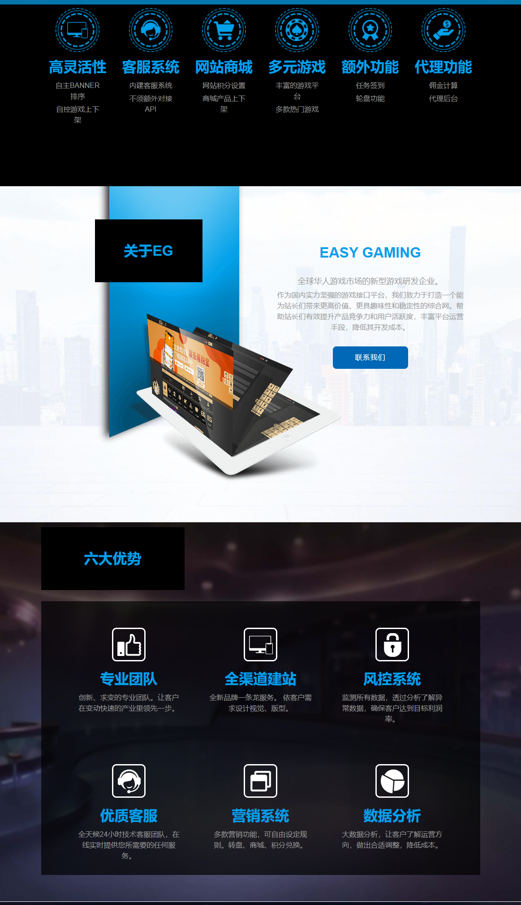

### 產品模板展示

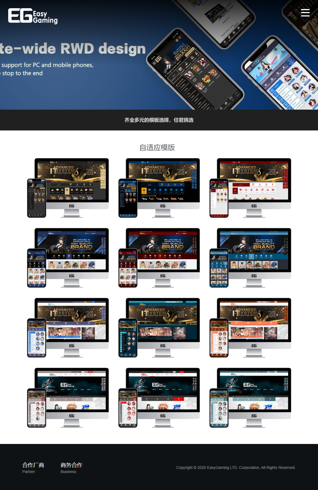

### APP開發畫面 [ [連結](https://invis.io/D6107PB75FSP) ]

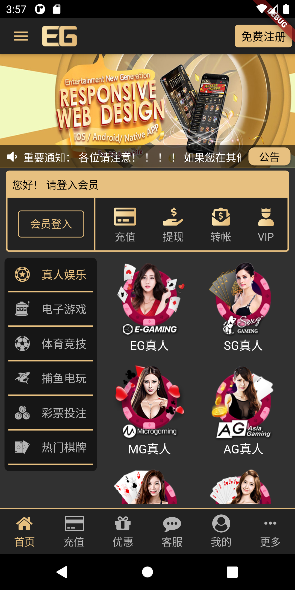

---

## 愛唱久久音樂科技專案項目

負責Android客製化系統機上盒所需相關應用軟體的開發工作

### 桌面應用

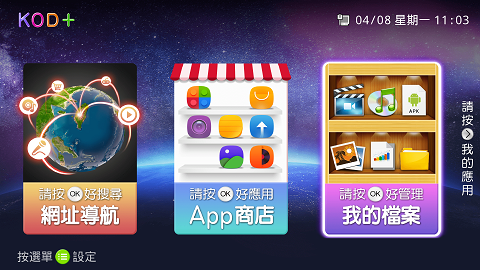

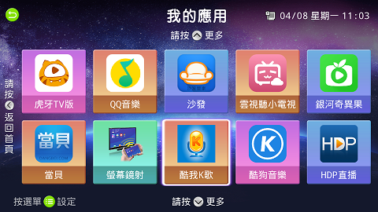

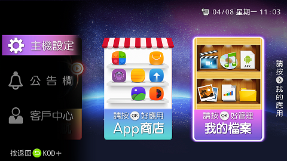

### 調音台

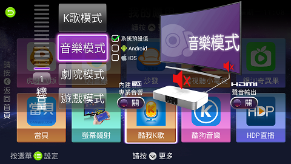

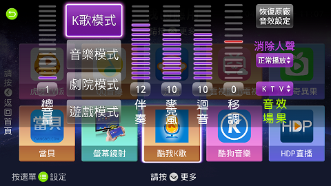

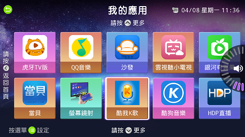

### 系統設定

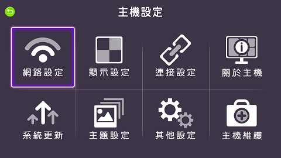

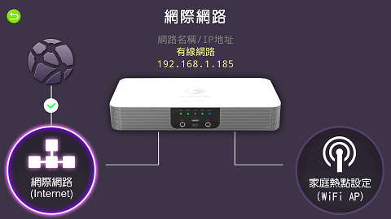

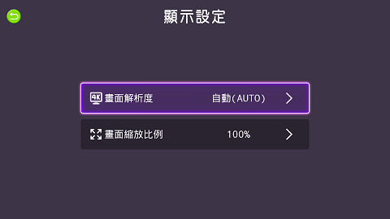

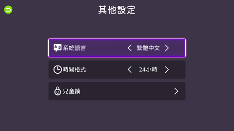

### 裝置維護(環境檢測)

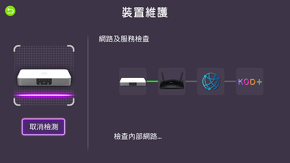

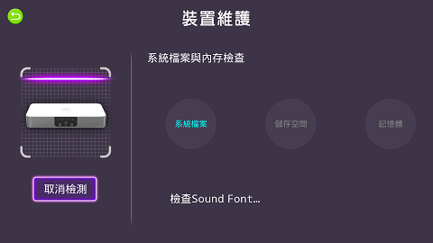

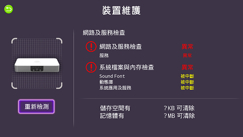

---

## 盲用電子閱讀APP輔具

專為視障者開發之電子閱讀輔具，利用手機內建Talkback功能以及額外安裝訊飛TTS語音系統，提供視障者更加方便的閱讀方式。

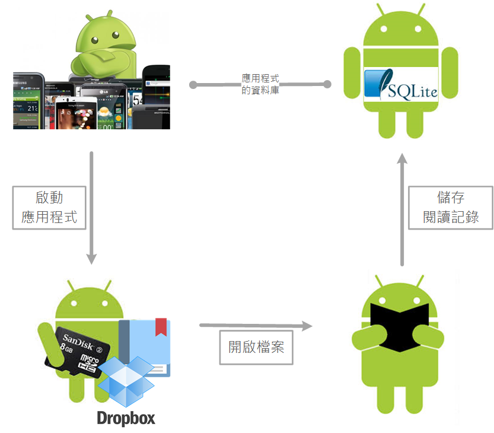

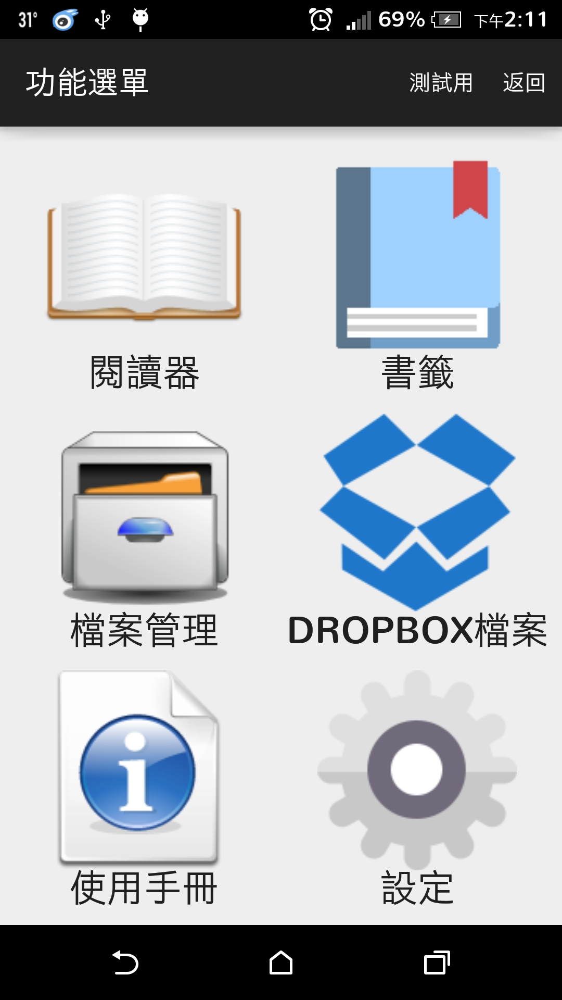

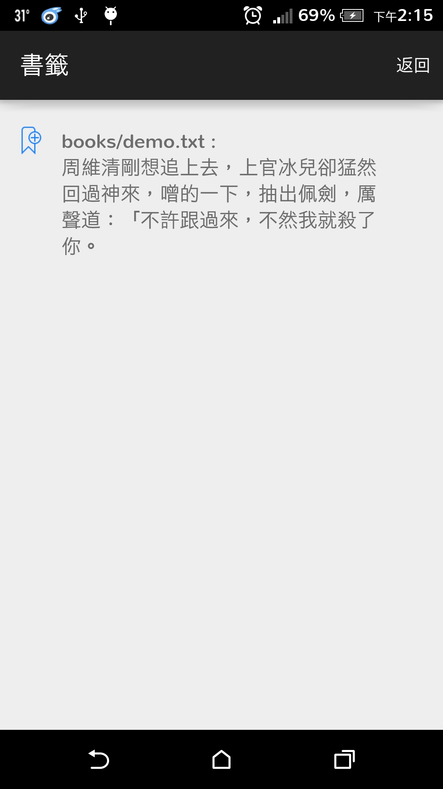

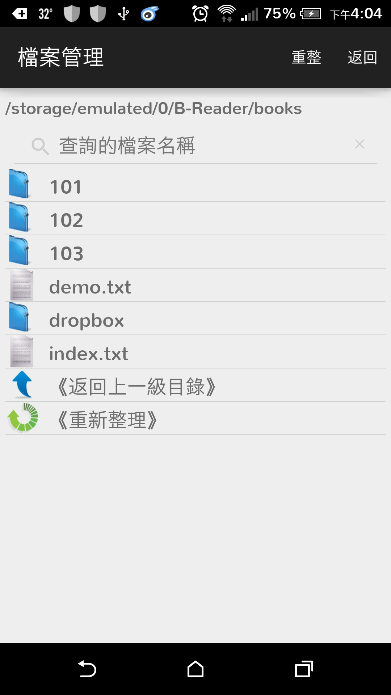

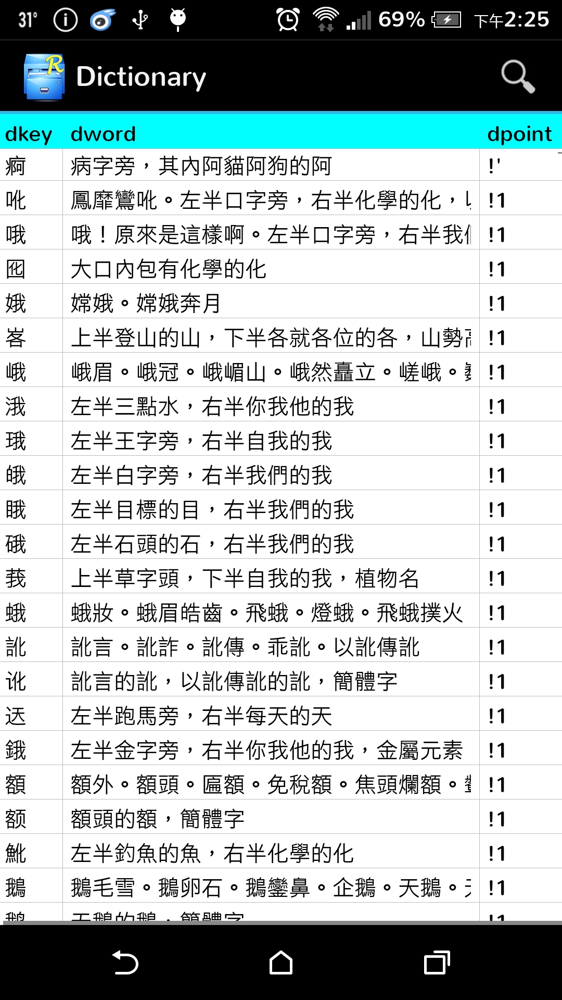

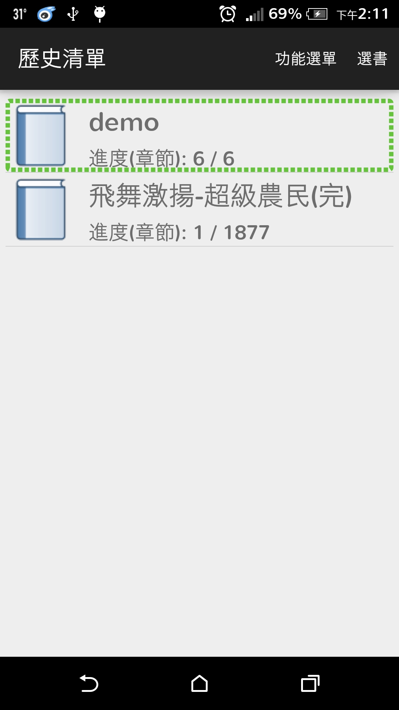

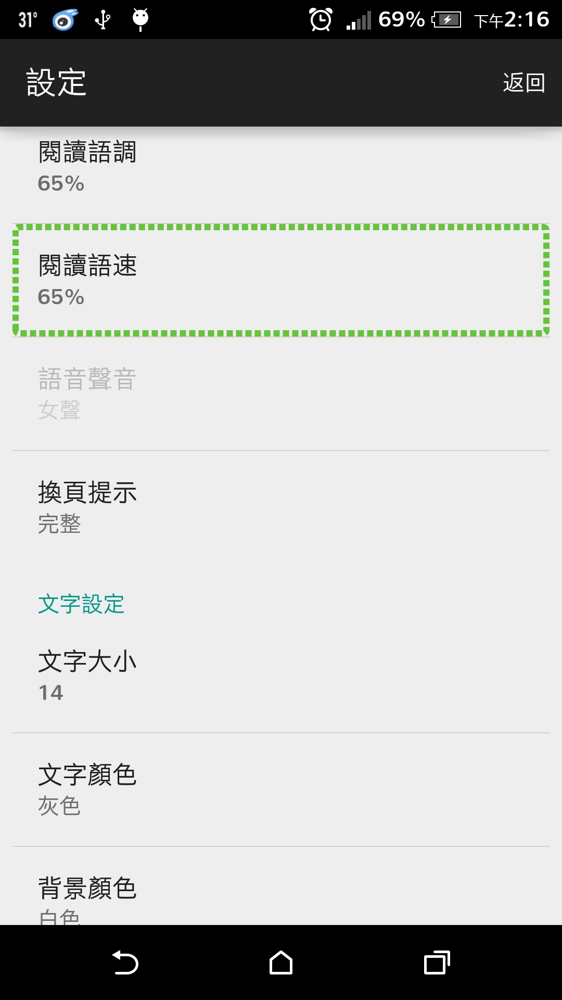

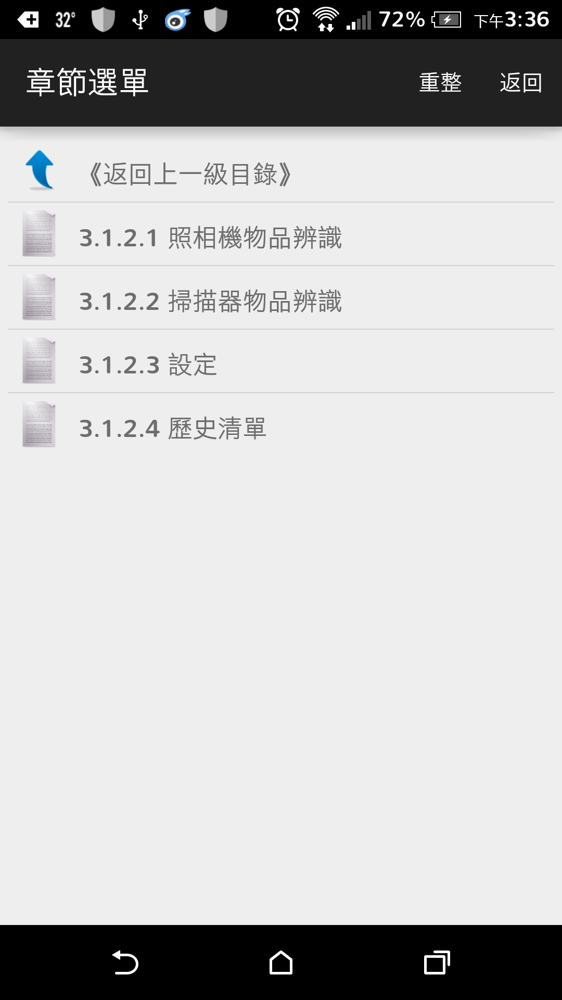

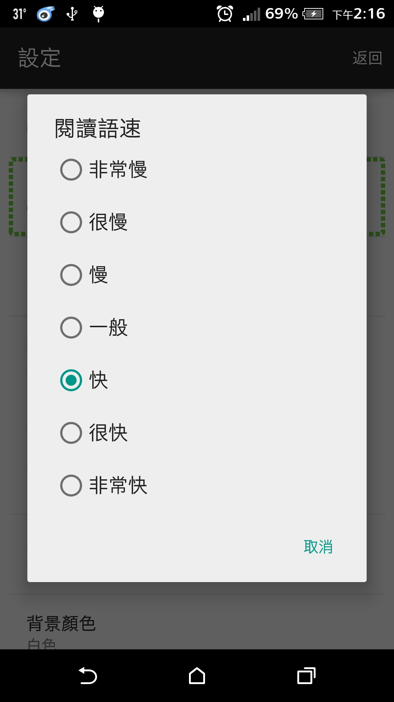

---

# 其他經歷

- IARIA - 國際科技研討會 ADVCOMP | 法國尼斯「高階電腦工程及應用科學研討會」July. 2015
- 靜宜大學 | 研究助理 Nov. 2014 - Feb. 2016
- 中山醫學大學 | 「資料結構」課程教學助理 Feb. 2015 - June. 2015
- 國際紅十字會 | 一般文件英中翻譯志工 July. 2012 - Sep. 2012
- 桃園楓樹國小 | 「資訊課」課後輔導人員 Oct. 2010 - Dec. 2010
- 空軍軍官學校 | 入伍生 July. 2010 - Aug. 2010
- 東海大學附屬實驗高級中學 | 學生車隊車隊長 Sep. 2008 - June. 2010

---

# 輔助技能

- 程式語言：RxJava/RxAndroid、XML、Obj-C
- 開發工具：Android Studio、Visual Studio Code、WinSCP
- 專案管理：Git、Markdown、UML、Trello
- 資料庫及ERP：MS SQL (SQLite)、MySQL
- 電腦應用：Word、Excel、PowerPoint、Outlook、Visio、SPSS、AMOS、Adobe Acrobat
- 繪圖軟體：Adobe Photoshop、GIMP

---

# 證照

- TOEIC Blue (805) 證照
- 臺灣師範大學翻譯研究所中英筆譯基礎訓練班結業證書
- 電腦技能基金會 TQC Word/Excel/PowerPoint 合格證書

---

# 語言能力

- 國文 精通
- 英文 普通

    (◇聽力 80%  ◇口說 60%  ◇讀寫 70%)

- 台語 略懂

---

# 興趣

- 閱讀
- 籃球
- 游泳
- 音樂
- 旅遊

---

# 自傳

高科技時代，國際間的競爭多以資訊技術為主軸。我從小對電腦資訊就有濃厚的興趣，也利用課餘到巨匠電腦學習，精熟許多軟體操作，並規劃一步步實現自己的人生志向與學業目標。　

銘傳大學就讀期間，在老師專業指導及同學相互切磋下，克服許多學習瓶頸，也讓學習成為一種樂趣一種美好的回憶。並在資訊管理領域立基紮根，我覺得這四年的規劃是一種大範圍對資訊管理專業的導入，是讓學生對國際整體趨勢有一個清楚的解析度。有了這樣的體認之後，我規劃朝一個專業領域集中鑽研，於是我報考了中山醫學大學研究所的醫學資訊學系碩士班。　

研究所三年我持續精進自己對軟體設計方面的理解，累積實務設計經驗，2016年時赴法國尼斯發表了自己的研究專題，並在論文發表後取得碩士學位。以期在日後的職場中展現更好的專業，實現自己的志向與理想。　

在學期間我曾參與多項APP開發，提交研究作品，赴國際科技研討會以英文發表PLC專題，也曾協助科技部健康暨輔具大展上B-TAG輔具發表與操作展示。熟諳Java、C++、Obj-C、XML、SQL等程式設計語言，也熟悉XCode、Android Studio、Eclipse等開發環境及Git版本控制。　

我的第一份工作在愛唱久久音樂科技公司，在學時間的經歷讓我能在短時間內取得主管信任，將多項機上盒Android應用軟體及系統服務開發專案交由我負責，並參與及協助雲端應用軟體開發、藍芽裝置應用軟體開發以及客製化系統軟硬體整合工作項目。此工作讓我熟悉Scrum專案敏捷開發流程，善用Kotlin、Java開發專案項目，並學習Flutter、LibGDX API等第三方API運用，更能初步利用Go處理資料交互，應用GitLab做團隊開發版本控制。

睿隆科技是最近的一份工作，讓我能熟悉 Android Kotlin 及 Web API 對接及資料處理，積累以 Kotlin 語法開發原生手機 APP 的經驗。後為因應公司跨平台開發需求，正式接觸以 Google Flutter 開發專案項目，善用 Codemagic 等 Github CI/CD 工具，深入了解 Google 最近著重的 Flutter App 開發及跨平台發佈流程。　

我性格樂觀，喜歡團隊合作，熱愛程式設計且不懼挑戰，並具有認真負責的敬業態度，及足以完成公司交付之開發項目的能力。

### Self Introduction

My name is Raven Chiang and I am a Information management graduate from Chung Shan Medical University, Department of Medical Information. I believe that my strong academic background and previous research assistant position me a strong entry level candidate for project development. To that end, I would like to express my interest in the full-time App Programmer position and have enclosed my resume and background information for your review.

### Experience

During my year as research assistant in Providence University, I have been working closely with the senior student on several projects, published my work, turn ideas into mobile application and finished my own study for master degree. I have enhanced my programing skills and improve my logical thinking to build better structural design during my time at school.

While I take my first job at iSing, I was responsible for a number of Android projects, participated and assisted in the work of software-hardware -integration and customized systems. I'm familiar with the Scrum, good at Kotlin, Java, LibGDX and other third-party APIs, communicate with back-end, and Git for version control.

And for my latest employment, I start with a project that uses Android Kotlin and Web API, which gives me more experience with Kotlin development. Then, in response to the company's cross-platform app requirement, I began to learn Google Flutter as main development language, and by making good use of Github CI/CD tools such as Codemagic, I became familiar with Flutter App development and cross-platform app distribution process.

### Epilogue

With a cheerful disposition, can-do attitude and interpersonal ability, I believe I am a particularly great fit for the App Programmer position because of my relevant experience and conscientious attitude toward work.

---

## 作品連結

- 睿隆科技專案 InVision Workflow 簡易版

    [https://invis.io/D6107PB75FSP](https://invis.io/D6107PB75FSP)

- 法國尼斯「高階電腦工程及應用科學研討會」PLC專題發表

    [https://drive.google.com/file/d/125W8bYZ-zzdRutTumEZUaPQjresTfddS/view?usp=sharing](https://drive.google.com/file/d/125W8bYZ-zzdRutTumEZUaPQjresTfddS/view?usp=sharing)

- 盲用電子閱讀APP輔具 (研究所學生專題)

    [https://drive.google.com/file/d/1znWNbassVzTU7C9xQtcdcxBKC1C0tcfp/view?usp=sharing](https://drive.google.com/file/d/1znWNbassVzTU7C9xQtcdcxBKC1C0tcfp/view?usp=sharing)

- Android Voice Box 大學畢業專題

    [https://drive.google.com/file/d/1JG2IJjqAYsO1IFzbn4i8R0GjEp9bQUWH/view?usp=sharing](https://drive.google.com/file/d/1JG2IJjqAYsO1IFzbn4i8R0GjEp9bQUWH/view?usp=sharing)